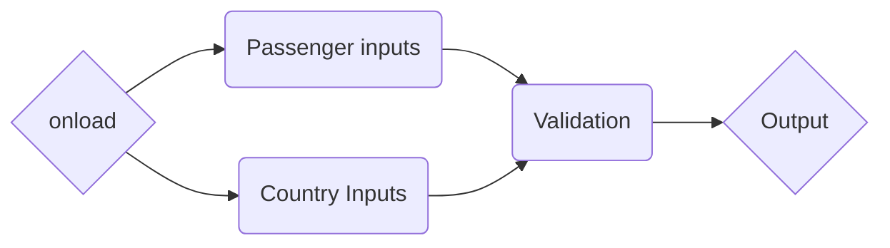

# Visa Discovery Widget - Quick Start Guide

This document excerpts the technical aspects of the integration of external websites with the Visa-Gate Widget. We distinguish between two ways of doing so, by using our CDN integration, or self hosted and integrating with our API.

Using our CDN will empower you to integrate our services in just a few minutes. This is recommended when using hosted websites, shared hosting, beginner web-developers and integrators who just wish to test the service.

On the other hand, a self-hosted version of the widget allows you to customize the look and feel of the widget, this is a great option for advanced developers and enterprise users who wish to achieve a deeper integration.

The API integration allows existing applications to extract information about travel and visa requirements from our server in a programmatic manner. This is very useful for corporate environments.


## Using our CDN

Integrating with our hosted version of the widget takes just a few minutes and requires only copy-pasting two lines of HTML code into your existing application. The code is here:

```
<div id="visa-gate-widget"><a href="https://visa-gate.com/">Powered by Visa-Gate</a></div>
<script type="text/javascript" src="https://widget.stage.visa-gate.com//assets/js/bootstrap.js"></script>
```

We will automatically load the required assets and render the widget. It will also be directly connected to our API, so you can start using it straight away.


### Notes on the pre-release version

Our pre-release version requires a few additional settings to enable the pre-release mode. To do so, just copy these lines right before the `</head>` tag of your HTML document.

You can copy these into a layout file or a header file if needed, this code just defines a few settings and will not add loading time to your website.

```
<meta name="viewport" content="width=device-width,initial-scale=1.0">
<meta name="_scss" content="assets/scss/_/">
<meta name="vg.assets" content="https://widget.stage.visa-gate.com/assets">
<meta name="vg.api" content="https://api.stage.visa-gate.com/"> 
```


## Forking our demo repository

Wish to play with our existing front end code? Make modifications and improvements? Zoom and enhance? This allows you to host the same widget we provide publicly, but  on your own server, allowing you to modify how it works.

You can clone our repo by running:

```
git clone ssh://git@phabricator.magic3w.com/source/Visa-Discovery-Widget.git
git submodule update --remote --init
make css
```


> **Note**: The repository is not available publicly during pre-release. You will need to request access from a Visa-Gate representative.

You will have a copy of our code on your system, and you're free to make any ammends you wish. Here are some pointers on where you can find the files you need to adjust the system:

 - `index.html` is the main entry point to the application. You can rename this file as you wish.
 - `assets/scss` contains the SASS files for our project. Modifying the styles in them will affect the look of the application. You can use them to adjust some of the layout choices for the widget.
 - `assets/css` will contain the compiled CSS files for our project. Modifying them is discouraged, since recompiling the SASS files will overwrite them.
 - `assets/js` contains the scripts that our application needs to work. It should contain files for different alternative mechanisms of displaying the widget and organize the inputs  and outputs.
 - `assets/js/bootstrap.js` This file will initialize the widget, prepare the dependency injector, prepare the router and initialize the _pipes_.
 - `assets/templates` contains HTML files that are dinamically pulled in by the widget.

### Understanding the front end coding: pipes

For the frontend, we chose to use a pipe pattern. Every module that we load provides a series of inputs and an output. In the widget it looks something like this:


You can subscribe to an existing module at any given point. Allowing you to insert data or subscribe to an output. 


## Interfacing with the API

If your  application needs a deeper level of integration, is not a Javascript / HTML application or you wish to implement an automated service you may wish to send requests to the API directly.

Our discovery API is really simple and provides four main interface points:

 - `https://api.visa-gate.com/search/find/document/%string%.json` to search for document information. This is used for autocompletion.
 - `https://api.visa-gate.com/search/find/country/%string%.json` to search for country information. This is used for autocompletion.
 - `https://api.visa-gate.com/regulation/find/%ISO3166%.json`  will provide a set of regulations for the country.
 - `https://api.visa-gate.com/itinerary/test.json` - this endpoint calculates the visa requirements for the passenger and country combination provided. A sample request follows.


### Itinerary calculation request sample

The request to generate a visa recommendation is really simple. Just provide a list of passengers, the documents they have (at least a passport is needed) and you're good to go.

```json
{"people":
	[
		{"name":"Passagier","documents":["PDE"]}
	],
	"stops":[
		{"country":"RU","reason":"tourist"},
		{"country":"CN","reason":"tourist"}
	]
}
```

The server will generate a very elaborate response to your request. It will look as follows and contain all the required information for you to inform the passenger whether they need a Visa, and which one the system recommends for them.

For detailed information on what each field reports, and what you need please consult the API documentation. You will need to request this from your Visagate representative.

```json
{"payload":
	[
		{
			"name":"Passagier",
			"documents":["Pass (DEUTSCHLAND)"],
			"stops":[
			{"country":{"ISO":"RU","name":"RUSSLAND"},
			"reason":"tourist",
			"granted":false,
			"candidates":[
				{"documents":[
					{
					"identifier":"VRUTO90",
					"name":"Russland Privatvisum (bis 90 Tage)",
					"recommended":false,
					"product":{"id":153,"url":"https:\/\/www.visa-gate.com\/node\/153", "price":{"amt":"12050","natural":120.5,"currency":"EUR"}}
					}
				]},
				{"documents":[...]},
				{"documents":[]}
			],
			"grants":null,
			"_rid":"492",
			"evaluated":51
		},
		{
			"country":{"ISO":"CN","name":"CHINA"},
			"reason":"tourist",
			"granted":false,
			"candidates":[...]
		}
	],
	"request":"{\"people\":[{\"name\":\"Passagier\",\"documents\":[\"PDE\"]}],\"stops\":[{\"country\":\"RU\",\"reason\":\"tourist\"},{\"country\":\"CN\",\"reason\":\"tourist\"}]}"
}
```

